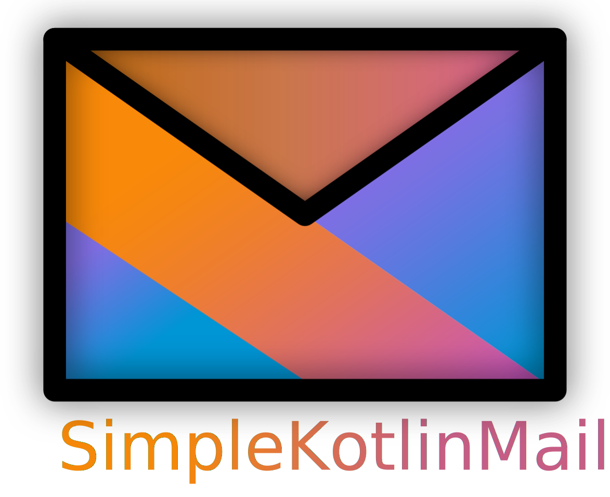

_SimpleKotlinMail is a Kotlin Mail API, using Kotlin Coroutines all the way through._

## Features

- build emails
- send emails (using an external SMTP server)
- receive and process emails
- TLS support

## To get started, visit the **[Documentation](https://bluefireoly.github.io/SimpleKotlinMail/)**.

## Examples

The purpose of the following code snippets is to provide an insight into the API. However, they are not suitable for learning the API, you should use the actual documentation for this.

### Build

Build an email:

```kotlin
val email = emailBuilder {
    from("no-reply@example.com")
    to("foo@bar.com")

    withSubject("Important question")
    withPlainText("Hey, how are you doing?")
}
```

### Send

Send that email:

```kotlin
suspend fun main() = email.send()
```

### Server / Receive

Create a custom SMTPServer:

```kotlin
val smtpServer = smtpServer {
    mailListener {
        println(it.email.plainText)
    }
}.start(keepAlive = true)
```

### Convert

```kotlin
// EML String -> Email
string.toEmail()
// MimeMessage -> Email
mimeMessage.email
```

### HTML

Inside the email builder, you can easily access kotlinx.html:
```kotlin
emailBuilder {
    withHTML {
        div {
            h1 { +"Really important question!" }
            p { +"Hey, how are you doing?" }
        }
    }
}
```

### And more

To learn more about SimpleKotlinMail, visit the **[Documentation](https://bluefireoly.github.io/SimpleKotlinMail/)**.

## Project information

This project uses [SimpleJavaMail](https://www.simplejavamail.org/) to deal with java MimeMessages in a more elegant
way. On the server side, this projects depends on a fork of [SubEthaSMTP](https://github.com/davidmoten/subethasmtp).

If you use the documented functionality of SimpleKotlinMail, everything will make use
of [kotlinx.coroutines](https://kotlinlang.org/docs/reference/coroutines-overview.html).
